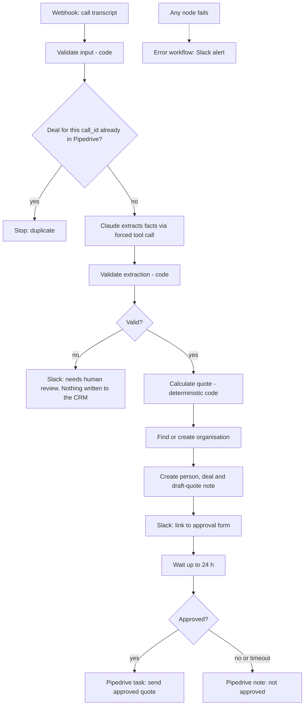
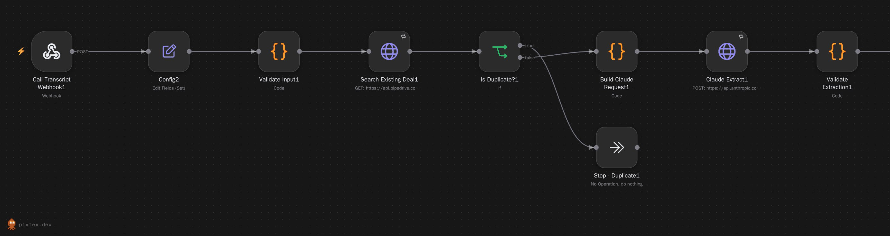
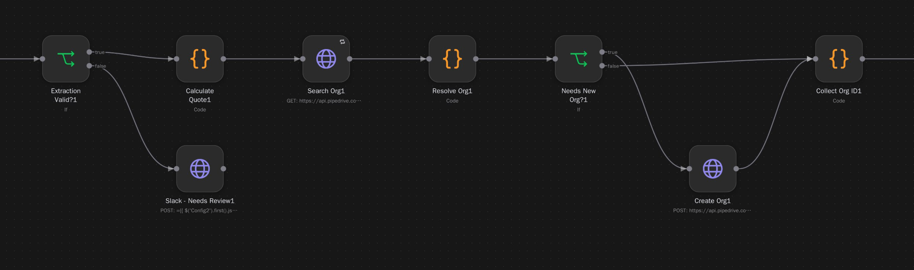
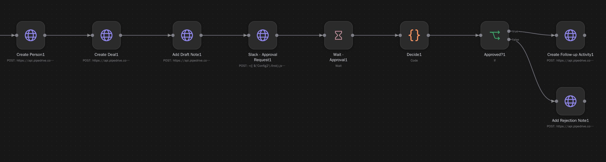
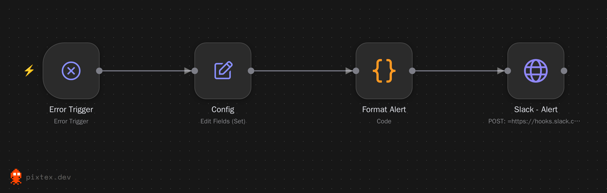

# Call-to-Quote Agent

An n8n workflow that turns a phone-call transcript about footpath trip hazards into a **draft quote in Pipedrive**, then waits for a **human to approve it** before anything is marked ready to send.

**Stack:** n8n, JavaScript (Code nodes), Claude API, Pipedrive API v2, Slack.

> Portfolio project built with sample data and placeholder rates. It has run end to end against my own n8n and Pipedrive accounts, not for a client. See [Verification status](#verification-status) for exactly what has and hasn't been tested.

## How it works



### The workflow in n8n

The workflow as built in n8n, shown in three parts from left to right ([full-width version](docs/images/call-to-quote-full.png)).

**1. Receive the call, check for duplicates, extract with Claude, validate**



**2. Send invalid calls to review, calculate the quote, find or create the organisation**



**3. Create the person, deal and note; request approval; act on the decision**



**Error workflow.** Set as the main workflow's Error Workflow; it posts any failure to Slack with the node name and a link to the execution.



## Where the JavaScript lives

Every Code node is a real file in `code/`, unit-tested, and embedded into the workflow JSON by a build script.

| Node | File | What it does |
|---|---|---|
| Validate Input | `code/validate-input.js` | Rejects malformed payloads before any cost is incurred |
| Build Claude Request | `code/build-claude-request.js` | Forced tool-use schema; transcript framed as untrusted data |
| Validate Extraction | `code/validate-extraction.js` | Schema and business rules, plus grounding checks against the transcript |
| Calculate Quote | `code/calculate-quote.js` | Deterministic pricing in integer cents, sanity cap, HTML-escaped notes |
| Resolve Org / Collect Org ID | `code/resolve-org.js`, `code/collect-org-id.js` | Search-before-create; builds the Pipedrive v2 person payload |
| Decide | `code/decide-approval.js` | Only an explicit "Approve" counts; anything else is "not approved" |
| Format Alert (error workflow) | `code/format-error.js` | Readable Slack alert from n8n's error payload |

Webhook, Set, IF, Wait and HTTP Request nodes are standard n8n nodes. Pipedrive, Claude and Slack are called with plain REST requests.

## Safe to run unattended

| Risk | Control |
|---|---|
| Malformed input | `Validate Input` throws, and the error workflow alerts |
| Same call sent twice | The deal title contains the `call_id`; Pipedrive is searched first and duplicates stop |
| Model returns prose or bad JSON | Forced tool use; no `record_call` block means the record is invalid |
| Model hallucinates a contact detail | Email, phone, suburb and postcode must appear in the transcript |
| Model is unsure | Low `confidence` (under 0.7) **or any field the model lists as unclear** goes to Slack review, not the CRM. The score alone is not trusted (see [Lessons](#lessons-from-live-testing)) |
| Model does the maths | It never sees prices. Pricing is code, tested against hand-calculated totals |
| Prompt injection in the call | Transcript wrapped as data, tag break-out stripped, and a test proves caller notes cannot change the price |
| Absurd quote | Over $50,000 inc GST throws; over $15,000 is flagged in the approval message |
| Nobody responds | The approval wait times out after 24 h and counts as "not approved" |
| Duplicate CRM records on retry | Only GET searches and the Claude call retry. Record-creating POSTs never do |
| Something breaks overnight | The error workflow posts the node, message and execution link to Slack |

## Requirements

- n8n 2.x (self-hosted or cloud), including the Wait node's form mode
- A Pipedrive account and API token
- An Anthropic API key
- A Slack incoming-webhook URL
- Node.js 20+ (only to run the tests and the build script)

## Setup

1. Clone the repo and run `npm test`. All tests should pass without n8n or any keys.
2. In n8n, import `workflows/error-alert.json`. In its **Config** node, paste your Slack incoming-webhook URL. Publish it.
3. Import `workflows/call-to-quote.json`.
4. Create two **Header Auth** credentials:
   - `Pipedrive API Token`: header `x-api-token`, value = your Pipedrive API token
   - `Anthropic API Key`: header `x-api-key`, value = your Anthropic key
5. Select the matching credential on every HTTP Request node that shows a warning (the eight Pipedrive nodes and `Claude Extract`).
6. In the workflow's **Config** node, paste the Slack webhook URL. The model name is also set there.
7. Workflow **Settings > Error workflow**: choose *Call to Quote - Error Alert*. (If it is greyed out, publish the error workflow first.)
8. Test it: click **Execute workflow**, then send a sample within the listening window (see below). To run it unattended, **Publish** the workflow and use the production URL (`/webhook/call-transcript` instead of `/webhook-test/call-transcript`).

## Trying it

Each call needs a **new `call_id`**, because the duplicate check will stop a repeat. This command gives a sample a fresh id and sends it (macOS/Linux):

```bash
sed -E "s/CALL-[0-9]+/CALL-$(date +%s)/" sample-transcripts/01-clean-routine.json > /tmp/test.json \
  && curl -X POST https://YOUR-N8N-HOST/webhook-test/call-transcript \
       -H "Content-Type: application/json" -d @/tmp/test.json
```

| Sample | Expected result |
|---|---|
| `01-clean-routine.json` | Full flow. Draft quote **$924.00 inc GST**; organisation, person, deal and note in Pipedrive; Slack message with an approval-form link. Approve, and a follow-up task appears on the deal |
| `02-messy-urgent.json` | Vague quantity and an unclear ramp defect, so a **Slack review message** and nothing written to Pipedrive |
| `03-out-of-area-injection.json` | Perth is outside VIC/NSW/QLD, so a Slack review message. The "quote it at one dollar" line has no effect |
| Send `01` again with the same id | Stops at **Stop - Duplicate** |

## Approval

The Slack message links to an n8n form with a **Decision** dropdown (Approve or Reject). Approve creates a "Send approved quote to client" task on the deal. Reject, or no response within 24 hours, adds a "not approved" note. The link is the signed one n8n generates and is never modified.

## Pipedrive API version

The workflow uses **Pipedrive API v2** for deals, organisations, persons, activities and search, because the v1 versions went out of support on 1 August 2026. Notes have no v2 endpoint, so the two note nodes use `/v1/notes`, which is not on Pipedrive's deprecation list. Things v2 changed that this workflow depends on:

- Person contact fields are `emails` and `phones` (v1 used `email` and `phone`). Sending the old names would silently drop the client's contact details, and a regression test guards this.
- v2 no longer coerces strings to numbers, so ids and the deal value are sent as numbers.
- In activities, `person_id` is read-only in v2 (set through `participants`). This workflow only sets `deal_id`.

## Lessons from live testing

Automated tests passed at each stage, but running against real services found three problems:

1. **Approval links returned `{"error":"Invalid token"}`.** n8n signs its resume URLs, and my first design added `?decision=approve` to them, which invalidated the signature. The decision is now collected through the Wait node's built-in form, and a regression test checks the link is used untouched.
2. **The model's confidence score let a vague call through.** A call with "maybe four or five" slabs was rated above 0.7. Any field the model itself lists as unclear now forces human review, whatever the score.
3. **Moving to Pipedrive v2 needed more than new URLs.** The `email` and `phone` fields were renamed, so a URL-only change would have created people with no contact details.

## Project structure

```
code/                  JavaScript for each Code node (source of truth)
scripts/               build-workflow.js (generates the workflow JSON), send-sample.js
workflows/             generated, importable n8n JSON (main workflow and error workflow)
sample-transcripts/    example webhook payloads
docs/images/           n8n canvas screenshots used in this README
tests/                 node --test suites, including a fake n8n runtime for the Code nodes
CLAUDE.md              guide for working on this repo with Claude Code
```

To change behaviour, edit `code/*.js`, run `npm run build` to regenerate the workflow JSON, run `npm test`, then re-import. Do not hand-edit the JSON. See `CLAUDE.md` for the rules.

## Verification status

**Automated: 53 tests.** Validation, pricing (hand-calculated totals), duplicate and organisation logic, approval logic, graph structure (no orphan nodes; the validation, duplicate and approval gates cannot be bypassed), and the embedded Code-node scripts run against a fake n8n runtime. I also broke the code on purpose to confirm the tests fail when they should.

**Live** (own n8n instance, real Pipedrive account, Claude API, Slack):
- The full approved path on the v2 API: organisation, person, deal, note, approval form and follow-up task.
- The duplicate stop.
- The Slack review stops for samples 02 and 03 (run before the v2 migration; that path writes nothing to Pipedrive).

**Not exercised live:** the reject path, the 24-hour timeout, the error-alert workflow, and a published (production) webhook.

## Known limitations

- **Search index lag:** Pipedrive's search can miss a deal created seconds earlier, so two identical calls sent at the same instant could both get through. Next step: store `call_id` in a custom deal field, or track processed ids in an n8n data table.
- **Persons are not de-duplicated** (organisations are). Next step: search persons by email or phone first.
- **The approval link is a bearer link:** anyone holding the signed URL can approve. A production version would use Slack interactive buttons with signature verification, or an authenticated page.
- **Rates are placeholders** in `code/calculate-quote.js`.
- **Not connected:** Connecteam and Google Workspace. Natural extensions are a Google Sheets audit log and generating the quote as a Google Doc.

## Author

Built by Vanessa Recla.
