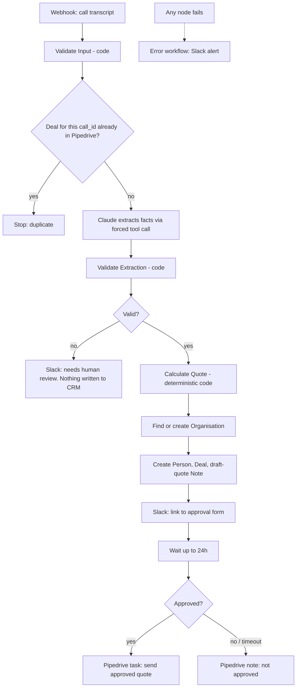

# Call-to-Quote Agent (n8n + Claude + Pipedrive)

Turns a phone-call transcript about footpath trip hazards into a **draft quote in Pipedrive**, then waits for a **human to approve it** (via a Slack message linking to an n8n approval form) before anything is marked ready to send.

> Portfolio/demo project built with sample data and placeholder rates. It has not run against a real business.

## What it does

## What I wrote in JavaScript vs. standard nodes

| Node | Type | What it does |
|---|---|---|
| Validate Input | **JS** (`code/validate-input.js`) | Rejects bad payloads before any cost is incurred |
| Build Claude Request | **JS** | Builds the API body: forced tool schema, injection-resistant prompt framing |
| Validate Extraction | **JS** | Schema and business rules, plus grounding checks against the transcript |
| Calculate Quote | **JS** | Deterministic pricing in integer cents, sanity cap, HTML-escaped note |
| Resolve Org / Collect Org ID | **JS** | Search-before-create logic and rejoining two branches |
| Decide | **JS** | Only an explicit "Approve" from the form counts; anything else is "not approved" |
| Format Alert (error workflow) | **JS** | Readable Slack alert from n8n's error payload |
| Webhook, Config, IF, Wait, NoOp | standard n8n nodes | |
| Pipedrive / Claude / Slack calls | HTTP Request nodes | Direct REST calls, no vendor-specific nodes |

## Safe-to-run-unattended checklist

| Risk | Control |
|---|---|
| Malformed input | `Validate Input` throws, and the error workflow alerts |
| Same call sent twice | Deal title contains the `call_id`; Pipedrive is searched first and duplicates stop |
| Model returns prose or bad JSON | Forced tool use; no `record_call` block means the record is not valid |
| Model hallucinates a contact detail | Email, phone, suburb and postcode must appear in the transcript |
| Model is unsure | Low `confidence` (default under 0.7) **or any field the model lists as unclear** goes to Slack review, not the CRM. The score alone is not trusted: a live test showed it can rate a vague call above 0.7 |
| Model does the maths | It never sees prices. Pricing is code, unit-tested with hand-calculated totals |
| Prompt injection in the call | Transcript wrapped as data, tag break-out stripped, and a test proves notes cannot change the price |
| Absurd quote | More than $50,000 inc GST throws; more than $15,000 is flagged in the approval message |
| Nobody responds | The approval form wait times out after 24h and counts as "not approved" |
| Duplicate CRM records on retry | Retries only on GET/Claude calls. Record-creating POSTs are never auto-retried |
| Something breaks at 3am | Error workflow posts the node name, message and execution link to Slack |

## Setup

1. `npm test` (needs Node 20+). All tests should pass; no n8n or API keys needed.
2. In n8n, import `workflows/error-alert.json`, open the **Config** node, paste your Slack incoming-webhook URL, save.
3. Import `workflows/call-to-quote.json`.
4. Create two **Header Auth** credentials:
   - `Pipedrive API Token`: header name `x-api-token`, value = your Pipedrive API token
   - `Anthropic API Key`: header name `x-api-key`, value = your Anthropic key
5. Open each HTTP Request node that shows a credential warning and select the matching credential.
6. Open the **Config** node: paste the Slack webhook URL (and change the model if you like).
7. Workflow **Settings > Error workflow**: choose *Call to Quote - Error Alert*.
8. Click **Listen for test event** on the webhook node, then run:
   `node scripts/send-sample.js sample-transcripts/01-clean-routine.json`

## Sample calls

| File | Expected result |
|---|---|
| `01-clean-routine.json` | Full flow. Draft quote **$924.00 inc GST**, deal + note in Pipedrive, Slack message with an approval-form link |
| `02-messy-urgent.json` | Vague quantity and unclear ramp defect, so **Slack review message**, nothing in Pipedrive (stops on the unclear fields even if the model reports high confidence) |
| `03-out-of-area-injection.json` | Perth is outside VIC/NSW/QLD, so Slack review. The "quote it at $1" line has no effect |
| Send `01` twice | Second run stops at **Stop - Duplicate** (see limitations on search lag) |

## Editing this project (with Claude Code)

The JS lives in `code/*.js`, not in the JSON. Edit there, then `npm run build` to regenerate `workflows/*.json`, then `npm test`, then re-import. See `CLAUDE.md`.

## Verified vs. not yet verified

- **Verified (50 automated tests):** all validation, pricing, dedupe/org logic, approval logic, graph structure (no orphan nodes, safety gates cannot be bypassed), and the embedded Code-node scripts run against a fake n8n runtime.
- **Not yet verified:** a live run in n8n against real Pipedrive, Claude and Slack. Before relying on it, check on your own instance: node parameter compatibility on your n8n version, the Pipedrive `x-api-token` header, the response shape of Pipedrive search, and that Claude accepts the model string in `Config`.

## Known limitations / next steps

- **Pipedrive search index lag:** the dedupe search can miss a deal created seconds earlier, so two identical calls sent at the same moment could both get through. Fix: store `call_id` in a custom deal field, or keep processed IDs in n8n data tables.
- **Persons are not de-duplicated** (organisations are). Next step: search persons by email or phone first.
- **Approval form link is a bearer link:** anyone holding the (signed, per-execution) URL can approve. Production version: Slack interactive buttons with signature verification, or an authenticated approval page.
- **Why a form instead of Approve/Reject links:** n8n signs resume URLs (`?signature=...`). My first version appended `?decision=approve` to that URL, which n8n rejected with `{"error":"Invalid token"}`. The fix was to stop modifying the URL and collect the decision through the Wait node's built-in form. A regression test now guards this.
- **Rates are placeholders** in `calculate-quote.js`.
- **Connecteam and Google Docs/Sheets are not connected.** Natural extensions: append every run to a Google Sheet audit log, and generate the quote as a Google Doc.
