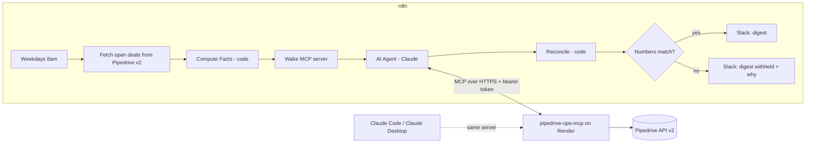

# Pipedrive Ops MCP Server + Daily Digest Agent

Two pieces that work together:

1. **`pipedrive-ops-mcp`**: a small Node.js **MCP server** that gives AI tools (n8n agents, Claude Code, Claude Desktop) safe access to Pipedrive: three read-only tools and one write tool that is locked by default.
2. **Daily Ops Digest**: an **n8n workflow** where a Claude agent uses those tools to write a morning digest of open and stale deals. The digest is **checked against numbers computed by plain code before it is posted**. If the agent's numbers are wrong, nothing is posted and a human is alerted.

> Portfolio/demo project. Tested with a fake Pipedrive; not yet run against a live account or deployed (see "Verified vs. not verified").



## MCP tools

| Tool | Type | What it does |
|---|---|---|
| `get_open_deals` | read | Open deal count, total value per currency, top deals by value |
| `get_stale_deals` | read | Open deals with **no scheduled next activity** and untouched for N days. Returns the full id list plus details for the longest idle |
| `get_deal_summary` | read | One deal: core fields, open activities, latest notes (markup stripped, length-capped, labelled untrusted) |
| `add_note` | **write** | Adds a note. **Disabled unless `ALLOW_WRITES=true`**, and does a dry run unless `confirm=true` on that call |

**Stale** means: open, no undone activity / next activity scheduled, and no update, stage change or creation for at least N days (default 7). Pipedrive's `update_time` may not move when a note or email is added, so read "stale" as "worth a look". The definition lives in one place, `src/domain.js`, and is used by both the server and the n8n workflow.

## Safety design

| Risk | Control |
|---|---|
| Server exposed to the internet | Every `/mcp` request needs `Authorization: Bearer <MCP_AUTH_TOKEN>` (constant-time compare). The server **refuses to start** without a token of 24+ chars |
| An agent changes CRM data | Writes are off by default (`ALLOW_WRITES`), `add_note` also needs `confirm=true` per call, and the digest agent is **not given** `add_note` at all (tool allow-list in n8n) |
| Prompt injection via CRM notes | Notes are stripped of markup, capped at 300 chars, labelled `recent_notes_untrusted`, the agent prompt says never to follow them, and the agent has no write tool anyway |
| Model reports wrong numbers | `Reconcile` compares its counts and id list to plain-code facts from a separate Pipedrive fetch. Mismatch means **withheld**. Posted numbers always come from the facts, not the model's text |
| Model output pings a channel | Slack text has HTML/Slack markup and `@channel/@here/@everyone` removed |
| Duplicate CRM writes on retry | The client retries only GETs. POST is never retried |
| Runaway pagination / slow API | Timeouts, cursor-repeat guard, page cap |
| Abuse / cost | Rate limit (120 req/min default), request body cap, no secrets in logs or error messages |
| Cold-start timeout on free hosting | The workflow pings `/health` (90 s timeout, retried) before the agent runs |

## Run locally

```bash
npm install
cp .env.example .env        # fill in the two tokens, then export them (or use your shell's env)
npm test                    # 55 tests, no network or keys needed
npm start                   # http://localhost:3000  (/health, POST /mcp)
```

## Deploy to Render

1. Push this folder to a GitHub repo.
2. Render: **New > Blueprint**, pick the repo (it reads `render.yaml`).
3. Set `PIPEDRIVE_API_TOKEN` in the dashboard when prompted. Render generates `MCP_AUTH_TOKEN` for you. Copy its value from the Environment tab.
4. After it deploys, check it:
   ```bash
   MCP_URL=https://<your-service>.onrender.com/mcp MCP_AUTH_TOKEN=<token> npm run smoke
   ```
   You should see the four tool names and a small `get_open_deals` result.

## Connect n8n

1. **Credentials:** create a **Bearer Auth** credential named `Ops MCP Token` (the `MCP_AUTH_TOKEN` value), an **Anthropic** credential named `Anthropic account`, and reuse the `Pipedrive API Token` header-auth credential (header `x-api-token`).
2. Import `workflows/daily-digest.json`.
3. **Config node:** paste your Slack incoming-webhook URL and set `mcpBaseUrl` to your Render URL (no trailing slash).
4. **Ops MCP Tools node:** set the endpoint to `https://<your-service>.onrender.com/mcp`, transport **HTTP Streamable**, authentication **Bearer**, credential `Ops MCP Token`, Tools to Include **Selected**: `get_open_deals`, `get_stale_deals`, `get_deal_summary` (never `add_note`).
5. Attach credentials to the **Claude**, **Fetch Open Deals** nodes.
6. Click **Execute workflow** (Manual Test path). Expected: a Slack digest ending "Counts verified against Pipedrive data before posting."
7. To run it on schedule, set the workflow's Error Workflow (you can reuse the alert workflow from Project 1) and **Publish** it. Note: schedules only fire while your n8n instance is awake.

## Connect Claude Code / Claude Desktop

```bash
claude mcp add --transport http pipedrive-ops https://<your-service>.onrender.com/mcp \
  --header "Authorization: Bearer <MCP_AUTH_TOKEN>"
```
Then ask, for example, "Which open deals have gone stale this week?" (Write tools stay disabled unless you turn on `ALLOW_WRITES`.)

## Design decisions

- **Pipedrive API v2 for deals/activities.** v1 endpoints for those were deprecated and went "out of support" on 1 Aug 2026. Notes have no v2 endpoint yet, so `/v1/notes` is used (not on the deprecation list).
- **Stateless MCP server.** A fresh server per request means no sessions to lose on restart and nothing to leak between callers. Trade-off: no server-initiated streaming, which these tools don't need.
- **Two independent fetches.** The agent reads Pipedrive through the MCP server; the workflow reads it separately for ground truth. Agreement between the two is the check.
- **The model never does arithmetic that gets posted.** It writes the headline and follow-ups; counts and values are computed by code.

## Known limitations / next steps

- Ground-truth fetch handles up to 500 open deals; above that the workflow fails loudly rather than verify partially. Next step: page it.
- Rate limiter is a single in-memory window (fine for one instance; use a shared store if scaled out).
- Values in mixed currencies are reported per currency, not converted.
- `get_deal_summary` shows the latest 3 notes only.
- Not covered: Connecteam, Google Workspace. The same pattern (a small MCP server with allow-listed tools) extends to them.
- Project 1 (Call-to-Quote) still calls some Pipedrive v1 endpoints that are out of support; migrating it to v2 is the next maintenance task.

## Verified vs. not verified

- **Verified (55 automated tests):** all tool logic; auth (missing/wrong/short tokens); rate limit; body cap; fail-closed startup; retry rules (GET only); notes sanitising; write gating; reconciliation catching wrong counts, invented ids and hostile text; the workflow graph; and the embedded n8n Code nodes running against a fake n8n runtime. A real MCP client talks to the real HTTP server in the tests. I also broke the code on purpose in six ways to confirm the tests fail when they should.
- **Not verified:** deployment on Render; a live Pipedrive account (response shapes follow Pipedrive's published v2 OpenAPI file); importing the AI Agent / MCP nodes into your n8n version (node parameter names may need re-selecting in the UI); the agent actually following its prompt with live Claude.
