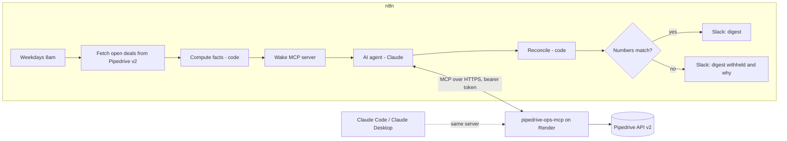
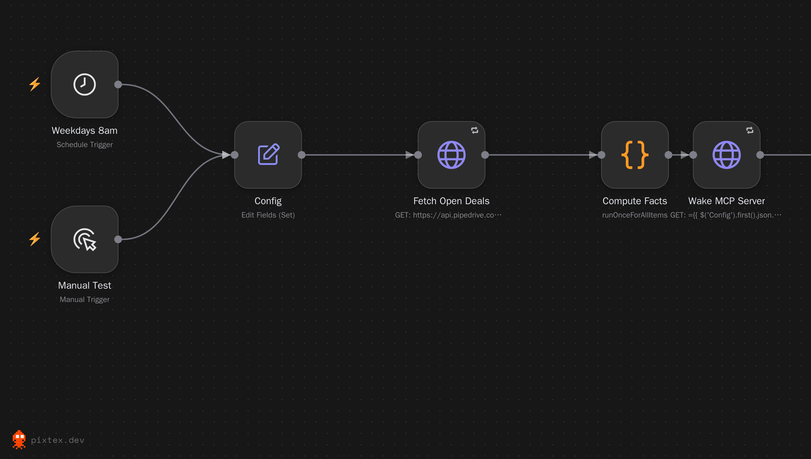
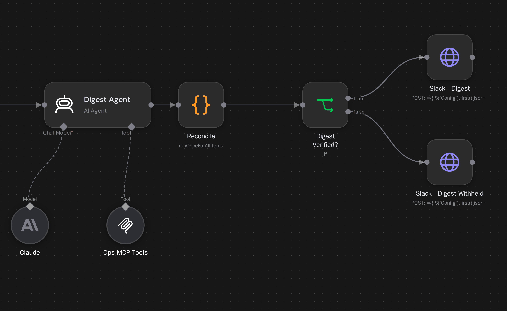

# Pipedrive Ops MCP Server and Daily Digest Agent

Two pieces that work together:

1. **`pipedrive-ops-mcp`**: a small Node.js **MCP server** that gives AI tools (n8n agents, Claude Code, Claude Desktop) safe access to Pipedrive: three read-only tools and one write tool that is locked off by default.
2. **Daily Ops Digest**: an **n8n workflow** in which a Claude agent uses those tools to write a morning digest of open and stale deals. The digest is **checked against numbers computed by plain code before it is posted**. If the agent's numbers are wrong, nothing is posted and a human is alerted.

**Stack:** Node.js, Model Context Protocol (Streamable HTTP), Pipedrive API v2, n8n, Claude, Slack, Render.

> Portfolio project. It has run end to end against my own Pipedrive account, but not for a client. See [Verification status](#verification-status) for exactly what has and hasn't been tested.



### The workflow in n8n

The daily digest workflow as built in n8n, shown in two halves ([full-width version](docs/images/daily-digest-full.png)). The Claude model and the MCP tools attach to the agent as sub-nodes.

**Left half: triggers, config, ground-truth fetch, server wake-up.** The weekday schedule and a manual trigger both feed the config; open deals are fetched straight from Pipedrive and turned into facts by code, and the MCP server is woken before the agent runs.



**Right half: agent, reconciliation, post or withhold.** The agent uses Claude and the read-only MCP tools; its output is reconciled against the computed facts, and the digest is posted only if they match.



## MCP tools

| Tool | Type | What it does |
|---|---|---|
| `get_open_deals` | read | Open deal count, total value per currency, top deals by value |
| `get_stale_deals` | read | Open deals with **no scheduled next activity** and untouched for N days. Returns the full id list plus details for the longest idle |
| `get_deal_summary` | read | One deal: core fields, open activities, latest notes (markup stripped, length-capped, labelled untrusted) |
| `add_note` | **write** | Adds a note. **Disabled unless `ALLOW_WRITES=true`**, and a dry run unless `confirm=true` on that call |

**Stale** means: open, no undone or next activity scheduled, and no update, stage change or creation for at least N days (default 7). Pipedrive's `update_time` may not move when a note or email is added, so read "stale" as "worth a look". The rule lives in one place, `src/domain.js`, and is used by both the server and the n8n workflow.

## Safety design

| Risk | Control |
|---|---|
| Server exposed to the internet | Every `/mcp` request needs `Authorization: Bearer <MCP_AUTH_TOKEN>` (constant-time compare). The server **refuses to start** without a token of 24+ characters |
| An agent changes CRM data | Writes are off by default (`ALLOW_WRITES`), `add_note` also needs `confirm=true` per call, and the digest agent is **not given** `add_note` at all (tool allow-list in n8n) |
| Prompt injection via CRM notes | Notes are stripped of markup, capped at 300 characters, labelled `recent_notes_untrusted`, the agent prompt says never to follow them, and the agent has no write tool anyway |
| Model reports wrong numbers | `Reconcile` compares its counts and id list to plain-code facts from a separate Pipedrive fetch. A mismatch means the digest is **withheld**. Posted numbers always come from the facts, not the model's text |
| Model output pings a channel | Slack text has HTML/Slack markup and `@channel` / `@here` / `@everyone` removed |
| Duplicate CRM writes on retry | The client retries only GETs. POST is never retried |
| Runaway pagination or a slow API | Timeouts, a repeated-cursor guard and a page cap |
| Abuse or cost | Rate limit (120 requests/minute by default), request body cap, no secrets in logs or error messages |
| Cold start on free hosting | The workflow pings `/health` (90 s timeout, retried) before the agent runs |

## Run locally

```bash
npm install
cp .env.example .env      # fill in the two tokens, then export them in your shell
npm test                  # 55 tests, no network or keys needed
npm start                 # http://localhost:3000  (GET /health, POST /mcp)
```

Generate an auth token with `node -e "console.log(require('crypto').randomBytes(32).toString('base64url'))"`.

## Deploy to Render

1. Push the project to GitHub. `package.json`, `package-lock.json` and `render.yaml` should be at the **repository root**. If the project sits in a subfolder, set the service's **Root Directory** to that folder in Render's settings.
2. In Render choose **New > Blueprint** and pick the repo (it reads `render.yaml`).
3. Set `PIPEDRIVE_API_TOKEN` in the dashboard when prompted. Render generates `MCP_AUTH_TOKEN`; copy its value from the Environment tab.
4. Check the deployment with the smoke script, which uses a real MCP client:
   ```bash
   MCP_URL=https://<your-service>.onrender.com/mcp MCP_AUTH_TOKEN=<token> npm run smoke
   ```
   You should see the four tool names and a small `get_open_deals` result.

Or check it with `curl`:
```bash
curl -s -X POST https://<your-service>.onrender.com/mcp \
  -H "Authorization: Bearer <token>" -H "Content-Type: application/json" \
  -H "Accept: application/json, text/event-stream" \
  -d '{"jsonrpc":"2.0","id":1,"method":"tools/list","params":{}}'
```

## Connect n8n

1. **Credentials:** a **Bearer Auth** credential named `Ops MCP Token` (the `MCP_AUTH_TOKEN` value), an **Anthropic** credential named `Anthropic account`, and a **Header Auth** credential named `Pipedrive API Token` (header `x-api-token`).
2. Import `workflows/daily-digest.json`.
3. **Config node:** set `slackWebhookUrl`, `mcpBaseUrl` (your Render URL, with no trailing slash and no `/mcp`), and `staleDays`.
4. **Ops MCP Tools node:** endpoint `https://<your-service>.onrender.com/mcp`, transport **HTTP Streamable**, authentication **Bearer** (`Ops MCP Token`), Tools to Include **Selected**: `get_open_deals`, `get_stale_deals`, `get_deal_summary`. Never add `add_note`.
5. Select the credentials on the **Claude** and **Fetch Open Deals** nodes.
6. Click **Execute workflow**. Expected: a Slack digest ending "Counts verified against Pipedrive data before posting."
7. For the weekday schedule, set an Error Workflow and **Publish** the workflow. Schedules only fire while your n8n instance is running.

**n8n memory:** the AI Agent node needs more memory than a 512 MB instance provides. In testing, n8n on a 512 MB host ran out of memory when the agent first ran. Use an instance with at least 2 GB, or run n8n locally (`npx n8n`).

## Connect Claude Code or Claude Desktop

```bash
claude mcp add --transport http pipedrive-ops https://<your-service>.onrender.com/mcp \
  --header "Authorization: Bearer <MCP_AUTH_TOKEN>"
```

Then ask, for example, "Which open deals have gone stale this week?" Write tools stay disabled unless you set `ALLOW_WRITES=true`.

## Troubleshooting

| Symptom | Likely cause and fix |
|---|---|
| Render build fails with `npm ci ... EUSAGE` | `package-lock.json` is missing from the directory Render builds in. Commit it, or set Root Directory to the project folder |
| `401 Unauthorized` from the server | Wrong or stale `MCP_AUTH_TOKEN`. Copy it again from Render's Environment tab |
| Tool result says `Pipedrive ... HTTP 401` | `PIPEDRIVE_API_TOKEN` on the server is wrong or missing |
| First request takes about a minute | Free-tier cold start. The workflow's Wake step handles it |
| "Wake MCP Server" node hangs | `mcpBaseUrl` in Config must be exactly the base URL, with no `/mcp` on the end |
| MCP Tools node says "fetch failed" | The node's own endpoint field still holds the placeholder. Set it to `https://<your-service>.onrender.com/mcp` |
| n8n shows "Lost connection to the server" when the agent runs | n8n ran out of memory; see the memory note above |

## Design decisions

- **Pipedrive API v2 for deals and activities.** The v1 endpoints for those went out of support on 1 August 2026. Notes have no v2 endpoint yet, so `/v1/notes` is used (not on the deprecation list).
- **Stateless MCP server.** A fresh MCP server per request means no sessions to lose on restart and nothing shared between callers. The trade-off is no server-initiated streaming, which these tools don't need.
- **Two independent fetches.** The agent reads Pipedrive through the MCP server; the workflow reads it separately for ground truth. Agreement between the two is the check.
- **The model never does arithmetic that gets posted.** It writes the headline and follow-ups; counts and values are computed by code.

## Project structure

```
src/domain.js        pure rules (stale definition, fact computation, HTML stripping)
src/reconcile.js     checks the agent's digest against computed facts; Slack-safe formatting
src/pipedrive.js     API v2 client (timeouts, GET-only retries, cursor pagination)
src/mcp.js           the four MCP tools
src/server.js        HTTP server, bearer auth, rate limit, body cap
src/config.js        environment config; fails closed
n8n/                 glue code wrapped around domain.js and reconcile.js for n8n Code nodes
scripts/             build-workflow.js (generates the workflow JSON), smoke.js
workflows/           generated, importable n8n workflow
tests/               node --test suites with a fake Pipedrive
docs/images/         n8n canvas screenshots used in this README
render.yaml          Render blueprint
CLAUDE.md            guide for working on this repo with Claude Code
```

Edit `src/` or `n8n/`, run `npm run build:workflow`, run `npm test`, then re-import the workflow. Do not hand-edit the workflow JSON.

## Verification status

**Automated: 55 tests.** All tool logic; authentication (missing, wrong and short tokens); the rate limit and body cap; fail-closed startup; retry rules (GET only); notes sanitising; write gating; reconciliation catching wrong counts, invented ids and hostile text; the workflow graph; and the embedded n8n Code nodes running against a fake n8n runtime. A real MCP client talks to the real HTTP server in the tests. I also broke the code on purpose in six ways (for example writes on by default, an auth bypass, retrying POST) to confirm the tests fail when they should.

**Live** (deployed on Render, real Pipedrive account):
- A smoke test with a real MCP client: the four tools listed, and all three read tools called successfully against live Pipedrive data.
- The digest workflow end to end: fetch, agent calling the MCP tools, reconciliation passing, and the digest posted to Slack.

**Not exercised live:** the `add_note` write path, the "digest withheld" branch (covered by tests), and the scheduled trigger.

## Known limitations

- The ground-truth fetch handles up to 500 open deals; above that the workflow fails loudly rather than verify partially. Next step: page it.
- The rate limiter is one in-memory window, fine for a single instance. Scaling out needs a shared store.
- Values in mixed currencies are reported per currency, not converted.
- `get_deal_summary` returns the latest three notes only, truncated to 300 characters each.
- Not covered: Connecteam and Google Workspace. The same pattern (a small MCP server with allow-listed tools) extends to them.

## Author

Built by Vanessa Recla.
